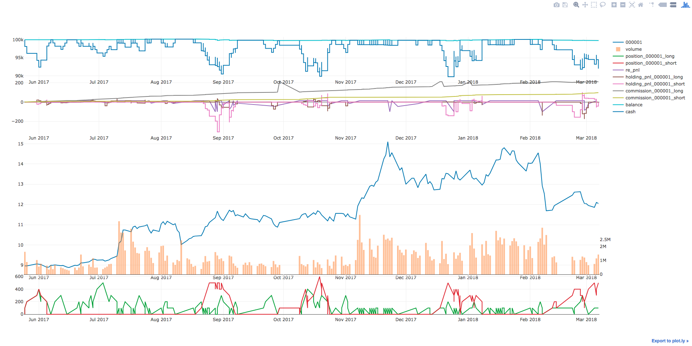
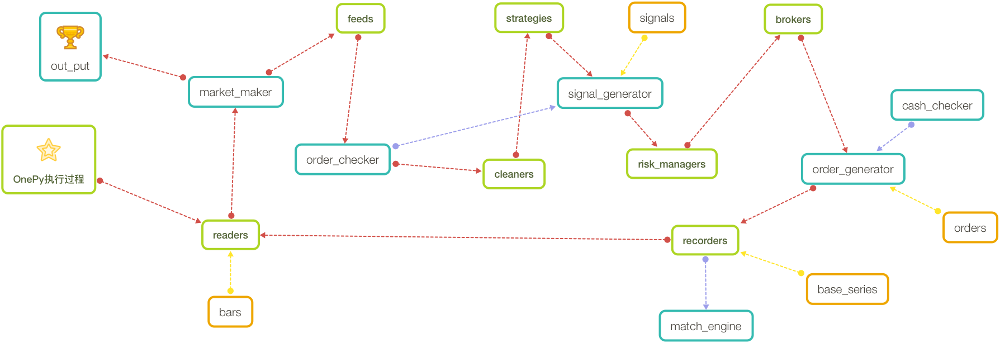

Onepy 2.00
===========
Onepy is an event-driven algorithmic trading Python library.

知乎专栏：[OnePy-基于Python的量化回测框架](https://zhuanlan.zhihu.com/onepy)

更新日志：[Change Log](https://github.com/Chandlercjy/OnePy/blob/master/CHANGE_LOG.md)

1.x版本请查看[OnePy 1.52](https://github.com/Chandlercjy/OnePy/tree/master)

PS. 缓慢更新中~

Install
-------
Onepy is developed using Python 3.6.x. You can install by pip and make sure they are up-to-date
```{python}
pip install pandas
pip install plotly
pip install funcy
pip install arrow
pip install pymongo

pip install OnePy_trader
pip install --upgrade OnePy_trader
```

Getting Started
---------------
请参考examples中的Tutorial. 

```{python}
import OnePy as op
from OnePy.builtin_module.recorders.stock_recorder import StockRecorder
from OnePy.custom_module.cleaner_sma import SMA


class SmaStrategy(op.StrategyBase):

    def __init__(self):

        super().__init__()
        self.sma1 = SMA(3, 40).calculate
        self.sma2 = SMA(5, 40).calculate

        self.sma3 = SMA(15, 40).calculate
        self.sma4 = SMA(30, 60).calculate

    def handle_bar(self):
        if self.sma1('000001') > self.sma2('000001'):
            self.buy(100, '000001', takeprofit=15,
                     stoploss=100, trailingstop_pct=0.1)
        else:
            self.sell(100, '000001')

        if self.sma3('000001') < self.sma4('000001'):
            self.short_sell(100, '000001', takeprofit=15,
                            stoploss=100, trailingstop_pct=0.1)
        else:
            self.short_cover(100, '000001')


op.data_readers.MongodbReader(
    database='tushare', collection='000001', ticker='000001',
    fromdate='2017-05-25', todate='2018-03-09')

SmaStrategy()

op.RiskManagerBase()
op.BrokerBase()

StockRecorder().set_setting(initial_cash=100000,
                            comm=1, comm_pct=None, margin_rate=0.1)
go = op.OnePiece()
go.logger.set_info(file=False)
go.sunny()
# go.output.show_setting()
go.output.plot('000001')
print(go.output.trade_log())
```

```
+--------------------------+
| Final_Value  | $99805.90 |
| Total_return | -0.19410% |
| Max_Drawdown | 0.49000%  |
| Duration     |     359.0 |
| Sharpe_Ratio | -0.38212  |
+--------------------------+
```





Road Map
--------


Contact
-------
I'm very interested in your experience with **Onepy**.Please feel free to contact me via **chenjiayicjy@gmail.com**

**Chandler_Chan**
