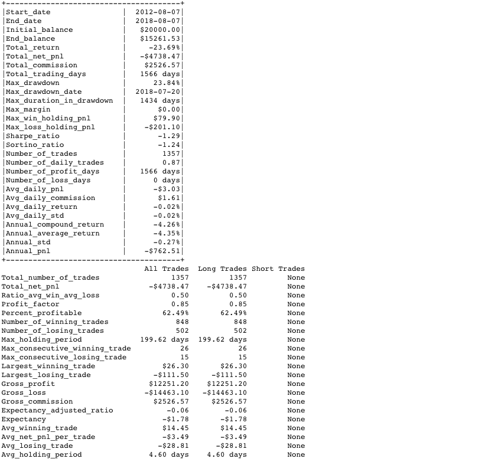
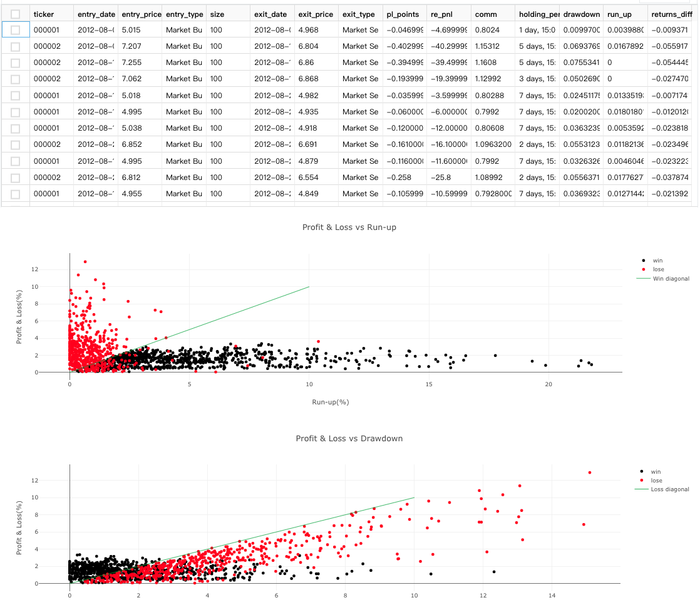
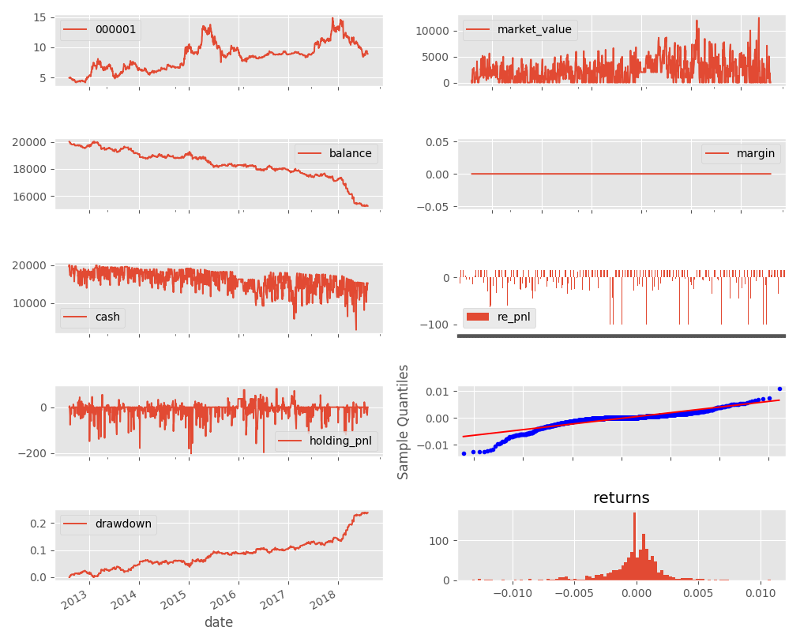

# Onepy 2.51

Onepy is an event-driven algorithmic trading Python library.

更新日志：[Change Log](CHANGE_LOG.md)
荒废的C++版：[OnePyPlus](https://github.com/Chandlercjy/OnePyPlus)

## Install

Onepy is developed using Anaconda Python 3.6.x. 

```{python}
pip install plotly
pip install funcy
pip install arrow
pip install pymongo
pip install retry
pip install TA-Lib
pip install dataclasses # python 3.7不用安装
```

将该项目解压后，参照[这里](https://www.jianshu.com/p/cb6447e1cf88)将OnePy项目文件夹添加到Python搜索目录


## Getting Started

- **Tutorial Series**
  - [Tutorial-1-Introduction](./examples/Tutorial-1-Introduction.ipynb)
  - [Tutorial-2-Strategy-and-Cleaner](./examples/Tutorial-2-Strategy-and-Cleaner.ipynb)
  - [Tutorial-3-Parameters-Optimization](./examples/Tutorial-3-Parameters-Optimization.ipynb)
  - [Tutorial-4-Forward-Analysis](./examples/Tutorial-4-Fordward-Analysis.ipynb)
  - [Tutorial-5-Multi-Strategies](./examples/Tutorial-5-Multi-Strategies.ipynb)
  - [Tutorial-6-Forex-Backtesting](./examples/Tutorial-6-Forex-Backtesting.ipynb)
  - [Tutorial-7-Oanda-Live-Trading](./examples/Tutorial-7-Onada-Live-Trading.ipynb)

- 知乎专栏：[OnePy](https://zhuanlan.zhihu.com/onepy)
  - [OnePy--构建属于自己的量化回测框架](https://zhuanlan.zhihu.com/p/27730907)
  - [OnePy 1.x--量化回测框架初探](https://zhuanlan.zhihu.com/p/28085149)
  - [OnePy 1.x--量化回测框架计算问题反省](https://zhuanlan.zhihu.com/p/28333715)
  - [近况与OnePy 2.00初探](https://zhuanlan.zhihu.com/p/35623695)
  - [OnePy 2.00--整体脉络解读](https://zhuanlan.zhihu.com/p/35860348)
  - [OnePy 2.1 -- 添加单元测试](https://zhuanlan.zhihu.com/p/36707021)
  - [从Python到C++，对量化回测的一点思考](https://zhuanlan.zhihu.com/p/41108459)
  - [OnePy 2.5--自省](https://zhuanlan.zhihu.com/p/49385769)

## Main Features

#### OnePy 综合方面:

*   事件驱动回测设计 ✓
*   股票、外汇回测 ✓
*   多品种回测 ✓
*   多策略回测 ✓
*   设置手续费, 保证金/手, 杠杆大小 ✓
*   设置成交价格为 close 或者第二天 open ✓
*   设置是否打印交易日志 ✓
*   Plot 画图模块 ✓
*   多进程参数优化 ✓
*   多进程Fordward analysis ✓

#### Tools 工具方面:

*   To_MongoDB:自定义数据统一格式后存入数据库 ✓
*   To_MongoDB:tushare 股票数据 CSV 存入数据库 ✓
*   Tushare API 数据多线程存入 MongoDB ✓
*   Oanda API 数据导入MongoDB ✓

#### DataHandler 数据方面:

*   CSV 数据读取 ✓
*   MongoDB 数据读取 ✓

#### Strategy 策略方面:

*   做多 buy & sell, 做空 sell & cover 指令 ✓
*   撤单 cancel_pennding, cancel_tst 指令 ✓
*   按百分比或盈亏多少钱, 设置止盈 Limit、止损 Stop 和 Trailingstop 移动止损 ✓
*   按百分比或者指定价格, 建立挂单。 ✓
*   技术指标 Cleaner 模块 ✓
*   整合 Talib 模块 ✓

#### Broker 执行方面:

*   模拟发送指令 ✓
*   模拟检查指令是否发送成功 ✓
*   打印交易日志 ✓
*   手续费 commission, 百分比类型和固定类型 ✓

#### Recorder 日志方面:

*   计算保证金, 仓位, 浮动利润, 已平仓利润, 总资金, 剩余现金, 收益率, 市值, 时间序列化 ✓
*   输出交易记录, 包括出场时间, 入场时间, 盈亏点数, 盈亏利润等 ✓
*   详细盘后交易结果分析 ✓

#### 延展性方面:

*   在 Environment 中存有原始所有信号信息, 生成的订单信息, 便于分析 ✓
*   自定义扩展事件源 ✓
*   自定义数据源, 返回迭代器给 OnePy 即可 ✓
*   自定义策略模块 ✓
*   自定义技术指标模块 ✓
*   自定义风控模块 ✓
*   自定义经纪商模块 ✓
*   自定义日志记录模块 ✓

## Quick Look






## Road Map


## Contact

I'm very interested in your experience with **Onepy**.Please feel free to
contact me via **chenjiayicjy@gmail.com**

**Chandler_Chan**
